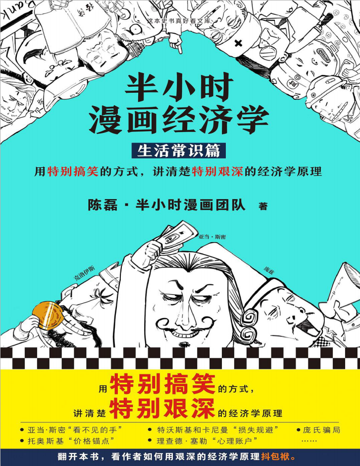
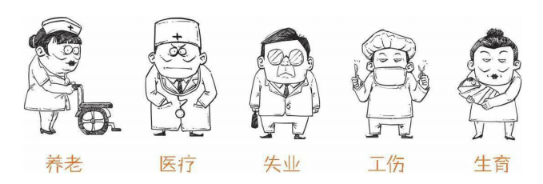
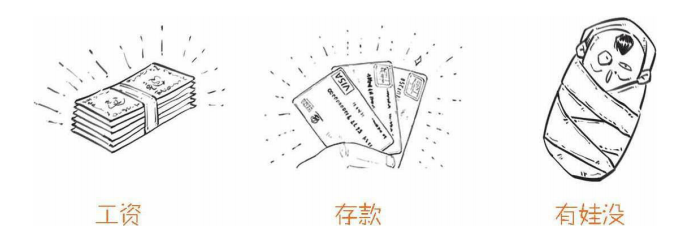
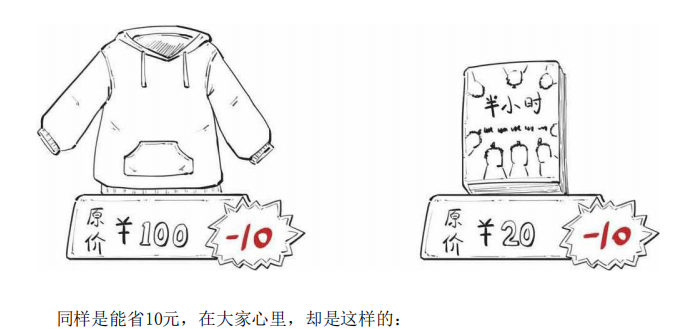
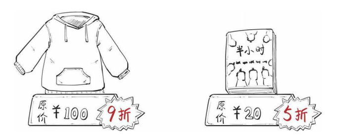
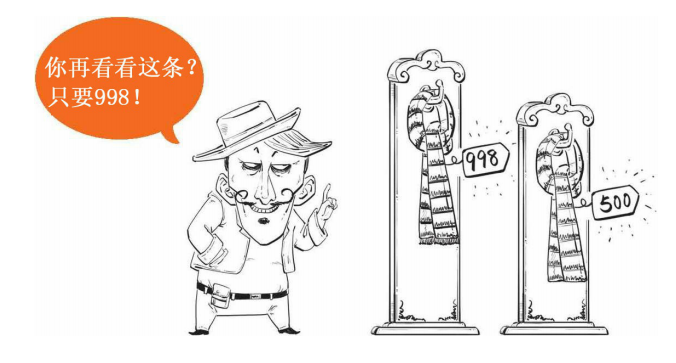
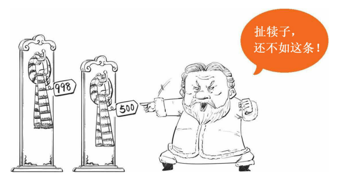
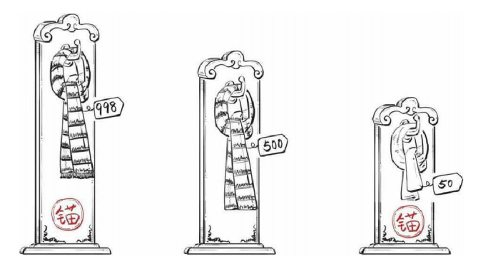

# 半小时漫画经济学
#### 生活常识篇

### 一、开篇:我们为什么学经济学
1.亚当·斯密的隐喻——看不见的手:市场上的产品和服务，大多是受利益驱使的。在利益的驱使下，经济就自行运转开了。

2.经济这个词，一开始的意思跟现在差了八条街。  economy翻译过来的，最早来源于古希腊语;经济这个词出现于东晋，是经世济民等词的浓缩，这格局就大了,是日本在到处学习的时候连在一起了.

### 二、货币的起源：钱打哪儿来的
1.货币起源于物物交换。

我有你想要的，你有我想要的，我们才能愉快地交易，这在传播学里有个专业
叫法：双重偶然性。

但是商品越来越多，大家的需求也越来越千奇百怪，哪有那么巧，对方正好有
自己想要的。于是，只能到处跑，到处换。

提出**中间物**

2.钱源于债务!

信用好

### 三、那些年缴过的“五险一金”到底是什么p79
1.公司为了让你好好工作，没有后顾之忧，帮你买了五险,统称社保，生老病死一条龙服务

**五险一金是国家强制公司缴的公司不给缴就是违法**

2.社保是怎么来的

工业革命的产物

3.五险一金是怎么交的

缴费基数 × 缴费比例 =应缴的钱

4.生育保险

男同胞先别急，虽然生不了娃，享受不了生育保险的福利，但可以休带薪陪产
假。

### 四、养老金能养老吗
分为基本养老金、职业养老金、个人养老金

### 五、医保到底保了个啥

1.医保的全名叫社会医疗保险，就是你向国家买了份保险，可以报销基础医药费的

工资的8%一小部分到医保卡，其他大部分到**统筹账户**

2.医保怎么报销

所谓的报销，就是你看完病后，医保给你补贴一些医药费。
有的是你在医院，人家直接给报了；有的比较麻烦一点，你得去当地管社保的
地方跑一趟

温馨提示：
非治疗类或第三方造成的伤害，一般医保不能报销，比如整形、保健、车祸、
打架等。

### 六、一口气搞懂到底要缴哪些税
"免征额"与“起征点”p178

### 七、买房前必须知道的二三事
房子是你的没跑，但土地可不是，万一哪天这块地被收回去，你怎么办？

### 八、人口与经济：生娃原来是个经济问题
一旦65岁以上老年人数量占总人口数的7%，就叫老龄化社会。

### 九、借钱那些事儿：如何避开借贷中的那些坑
早期借贷一般是国家用来维护社会稳定的，特点是：没什么利息。

老祖宗搞了几千年的佃农制，据说就是从借贷发展来

按传统经济学家的说法，人是理性的，大家都只会把钱借给靠谱的人，也只会
借自己有能力还的钱。

高富帅，人家借钱给你，分分钟还清，这叫优贷

矮矬穷，吃了上顿没下顿，冒险借钱给你，这叫次贷。

p2p：你把钱给一个平台，平台借给其他人。

##### 借贷避坑指南
想借钱，先看看你的还款能力。这个也简单，比如看这些：
> 
> 起码每个月的工资还完钱后，还有饭吃吧。如果有娃就更简单了，借贷之前，
想想娃的奶粉。

认清借贷机构:

现在借贷的机构五花八门，有名气的大公司正规，不会乱收钱，也不会说得天
花乱坠吸引人，比较靠谱。

另外就是看利率，法律就说了，民间借贷的利率高过36%属于高利贷，是非法
的。

### 十、消费心理学：消费者防剁手
> 套路一：心理账户
> 不说你需要吃保健品,而是说孝敬爸妈
> 
> 套路二：比例偏见
> 加1元送围巾
> 买一送一
> 其实第二件商品的价格含在第一件商品里面了
>
> 或者换一种说法
> 
> 
> 大家会自动把数字换算成比例，从而发现5折比9折划得来。但其实是一样的    
>
> 套路三： 价格锚点
> 想买500的,担心别人不会买,找一个还不如500的东西定一个更离谱的价格
> 
> 
> 发现没？998那条根本就不是拿来卖的，就是用来让你比的!
> 他们往往放在一起就是故意让消费者看到
> 
>
> 套路四： 损失规避
> 无理由退货
> 因为从心理上讲，我们得到一件东西会开心，失去会难过，这种难过是开心的很多倍。
> 只要商品没毛病，实际上很少有人退货，而且邮费也可能包含在价格中，所以商家是不吃亏的。关键是这招一出，东西就卖出去了。
>
>套路五： 沉没成本
> 没现货,交个订金
> 事实上，交了订金后，退货的概率会大大降低。
> 因为人作决定的时候，总会惦记自己付出了多少，这些付出的、不可回收的东西，就叫沉没成本。
> 简单说就是，付出得越多，就越不想放手,定金交的越多,越不容易退还

### 十一、传销大起底：珍爱生命，远离传销
前面投资人赚到的钱，其实就是后面投资人的钱(想投资没钱忽悠其他人干别的事情挣钱,把筹集的钱做投资)